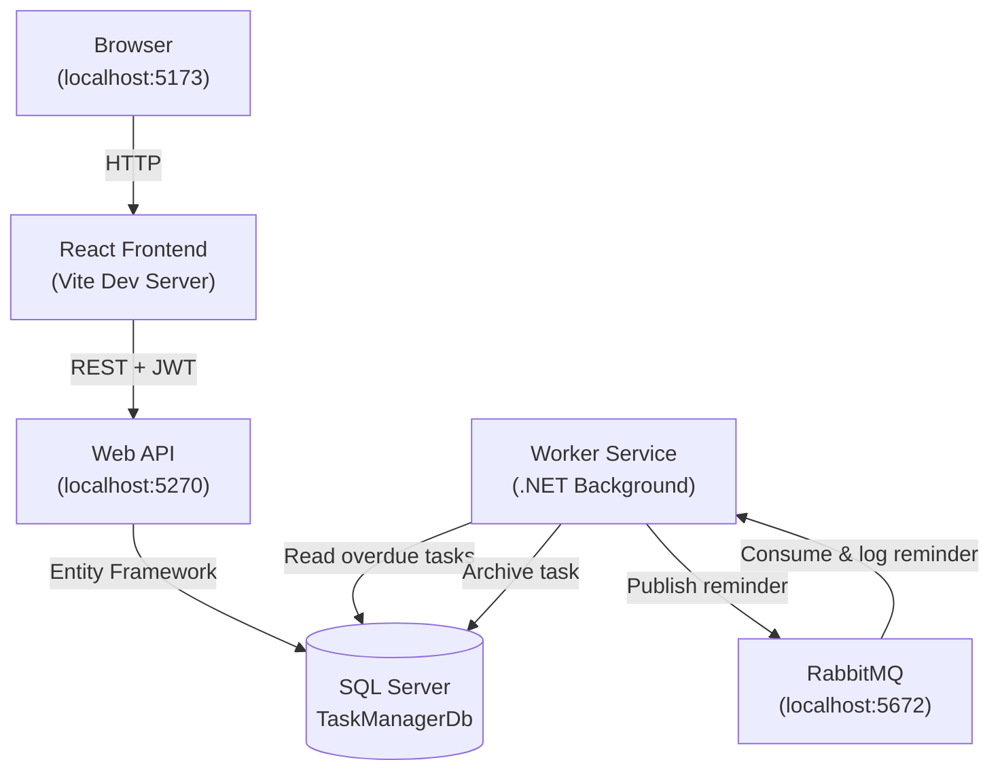

# Task Manager System

A full-stack web application for managing user tasks, built with a .NET Core Web API backend, a React frontend, and a .NET Background Worker Service that processes overdue task reminders via RabbitMQ.

---

## Table of Contents

1. [Project Overview](#1-project-overview)
2. [Key Features](#2-key-features)
3. [Architecture & Flow](#3-architecture--flow)
4. [Setup & Installation](#4-setup--installation)
5. [API Documentation](#5-api-documentation)
6. [Database Task](#6-database-task)
7. [Testing Strategy](#7-testing-strategy)

---

## 1. Project Overview

The **Task Manager System** is a multi-tier application that allows users to register, log in, and manage their personal tasks. Each task carries a title, description, due date, priority, full user contact details, and a flexible set of tags (many-to-many relationship).

A dedicated **Worker Service** runs continuously in the background, scanning the database every 60 seconds for overdue tasks. When it finds one, it publishes a reminder message to a **RabbitMQ** queue. The same service also subscribes to that queue and logs each reminder to the console — simulating a real-world notification pipeline.

---

## 2. Key Features

- **JWT Authentication** — Secure register, login, and logout. Tokens expire after 60 minutes.
- **Full Task CRUD** — Create, read, update, delete, and archive tasks per authenticated user.
- **N:N Tag Relationships** — Each task can have multiple tags; tags can be shared across tasks. New tags can be created inline from the UI.
- **Background Overdue Processing** — The Worker Service polls every 60 seconds, detects tasks past their due date, and automatically archives them after queuing a reminder.
- **RabbitMQ Reminder Queue** — Overdue task messages are published to and consumed from the `Remainder` queue with concurrent message handling (prefetch: 10).
- **React + Redux Toolkit Frontend** — State-managed UI with real-time 60-second polling, multi-filter/sort, and pagination.
- **Swagger UI** — Interactive API documentation available in development.
- **Input Validation** — Server-side and client-side validation on all fields.

---

## 3. Architecture & Flow

### High-Level Overview

The system is composed of three independently running processes that share a SQL Server database:

| Component | Technology | Responsibility |
|---|---|---|
| **Web API** | ASP.NET Core (.NET 8) | Exposes RESTful endpoints; handles auth and task CRUD |
| **Worker Service** | .NET Background Service | Detects overdue tasks; publishes/consumes RabbitMQ messages |
| **React Frontend** | React 19 + Vite + Redux Toolkit | User interface; communicates exclusively with the Web API |

### Interaction Diagram



### Request Flow

1. The **user** interacts with the React frontend in their browser.
2. The frontend dispatches Redux Thunk actions that call the **Web API** with a JWT bearer token.
3. The API reads and writes tasks/users/tags via **Entity Framework Core** to **SQL Server**.
4. Every 60 seconds, the **Worker Service** queries the database for non-archived tasks where `DueDate < now`.
5. For each overdue task, the Worker publishes a message to the **`Remainder`** RabbitMQ queue and archives the task in the database.
6. The built-in consumer picks up the message from the queue and logs: `Hi your Task is due {TaskTitle}`.

---

## 4. Setup & Installation

### 4.1 Prerequisites

Make sure the following are installed before proceeding:

| Prerequisite | Notes |
|---|---|
| [Node.js](https://nodejs.org/) v18+ | Required for the React frontend |
| [.NET 8 SDK](https://dotnet.microsoft.com/download/dotnet/8.0) | Required for the API and Worker Service |
| [SQL Server](https://www.microsoft.com/en-us/sql-server/sql-server-downloads) or **SQL Server LocalDB** | LocalDB is included with Visual Studio |
| [Docker Desktop](https://www.docker.com/products/docker-desktop/) | Required to run RabbitMQ |
| [Visual Studio 2022](https://visualstudio.microsoft.com/) (recommended) | Pre-configured multi-startup profile included |

---

### 4.2 Step 1 — Start RabbitMQ via Docker

Open a terminal and run the following command to start a RabbitMQ container with the management plugin:

```bash
docker run -d --name rabbitmq -p 5672:5672 -p 15672:15672 rabbitmq:3-management
```

- **AMQP (application port):** `localhost:5672`
- **Management UI:** `http://localhost:15672` (default credentials: `guest` / `guest`)

> Make sure Docker Desktop is running before executing this command.

---

### 4.3 Step 2 — Apply Database Migrations

The API uses **Entity Framework Core** with Code-First migrations. The database will be created automatically when migrations are applied.

**Option A — Visual Studio Package Manager Console** (recommended):

```powershell
Update-Database
```

> Make sure `TaskManager.api` is set as the Default Project in the Package Manager Console.

**Option B — .NET CLI** (from the solution folder):

```bash
dotnet ef database update --project TaskManager.api/TaskManager.api.csproj
```

This creates the `TaskManagerDb` database on `(localdb)\mssqllocaldb`.

---

### 4.4 Step 3 — Start the Backend API & Worker Service

Both backend projects are configured in a **multi-startup profile** in Visual Studio.

**Option A — Visual Studio (recommended):**

1. Open `TaskManagerBackend.sln` in Visual Studio 2022.
2. In the startup dropdown at the top toolbar, select **"New Profile"**.
3. Press **F5** to start both `TaskManager.api` and `TaskReminderService.worker` simultaneously.

**Option B — Command Line** (run each in a separate terminal from the solution folder `backend/TaskManagerBackend/`):

```bash
# Terminal 1 — Web API
dotnet run --project TaskManager.api/TaskManager.api.csproj

# Terminal 2 — Worker Service
dotnet run --project TaskReminderService.worker/TaskReminderService.worker.csproj
```

Once the API is running, it is available at:
- **API base URL:** `http://localhost:5270`
- **Swagger UI:** `http://localhost:7085/swagger`

---

### 4.5 Step 4 — Start the React Frontend

Open a terminal in the `frontend/` folder:

```bash
npm install
npm run dev
```

The frontend will be available at **`http://localhost:5173`**.

> The frontend is pre-configured to call the API at `http://localhost:5270`. No additional environment setup is needed for local development.

---

## 5. API Documentation

Interactive Swagger documentation is available in development mode at:

**`http://localhost:7085/swagger`**

To authenticate in Swagger, click **Authorize** and enter: `Bearer <your_token>` (obtained from the login endpoint).

### Authentication Endpoints — `/api/auth`

| Method | Endpoint | Auth Required | Description |
|---|---|---|---|
| `POST` | `/api/auth/register` | No | Register a new user (email, password, fullName, telephone) |
| `POST` | `/api/auth/login` | No | Authenticate and receive a JWT token |
| `POST` | `/api/auth/logout` | Yes | Invalidate the current session |

### Task Endpoints — `/api/tasks`

| Method | Endpoint | Auth Required | Description |
|---|---|---|---|
| `GET` | `/api/tasks` | Yes | Get all tasks for the current user (`?includeArchived=true` to include archived) |
| `GET` | `/api/tasks/{id}` | Yes | Get a single task by ID |
| `POST` | `/api/tasks` | Yes | Create a new task |
| `PUT` | `/api/tasks/{id}` | Yes | Update an existing task |
| `DELETE` | `/api/tasks/{id}` | Yes | Permanently delete a task |
| `PATCH` | `/api/tasks/{id}/archive` | Yes | Archive or unarchive a task |

### Tags Endpoint — `/api/tags`

| Method | Endpoint | Auth Required | Description |
|---|---|---|---|
| `GET` | `/api/tags` | Yes | Get the global list of all available tags |

---

## 6. Database Task

The following SQL query returns all tasks that have **at least two tags**, including the tag names and tag count, sorted by the number of tags in descending order:

```sql
SELECT 
    t.Id,
    t.Title,
    t.Description,
    t.DueDate,
    t.Priority,
    t.CreatedAt,
    STRING_AGG(tg.Name, ', ') AS TagNames,
    COUNT(tg.Id) AS TagCount
FROM Tasks t
INNER JOIN TaskTags tt ON t.Id = tt.TasksId
INNER JOIN Tags tg ON tt.TagsId = tg.Id
GROUP BY t.Id, t.Title, t.Description, t.DueDate, t.Priority, t.CreatedAt
HAVING COUNT(tg.Id) >= 2
ORDER BY TagCount DESC;
```

---

## 7. Testing Strategy

### Basic End-to-End Flow

Follow these steps to verify all components are working correctly together:

**1. Register and log in**
- Open `http://localhost:5173` in your browser.
- Switch to the **Register** tab and create a new account.
- Log in with the credentials you just created.

**2. Create tasks and tags**
- Click **"New Task"** and fill in all fields.
- In the Tags field, type a new tag name and press **Enter** to create it inline.
- Create at least one task with a **due date set in the past** to test the Worker Service.

**3. Verify overdue task processing (Worker Service)**
- Watch the **Worker Service console** (Visual Studio Output window or terminal).
- You can observe logs in the `..\backend\TaskManagerBackend\TaskReminderService.worker\bin\Debug\net9.0\logs` path as well
- Within 60 seconds, you should see a log entry like:
  ```
  Hi your Task is due My Overdue Task
  ```
- The task will be automatically **archived** in the database after processing.
- Reload the task list and confirm the overdue task no longer appears (or enable "Show Archived" if supported).

**4. Verify RabbitMQ message flow**
- Open the RabbitMQ Management UI at `http://localhost:15672` (login: `guest` / `guest`).
- Navigate to **Queues** and locate the `Remainder` queue.
- Confirm messages were published and consumed (the queue message count should return to 0 after processing).

**5. Test authentication boundaries**
- Log out and confirm that task endpoints return `401 Unauthorized` when accessed without a token.
- Verify that the frontend redirects back to the login screen on logout.

**6. Test CRUD operations**
- Edit an existing task and verify the changes are reflected in the list.
- Delete a task and confirm it is removed.
- Archive a task and verify the `IsArchived` flag is set correctly.

### Swagger Testing

For direct API testing without the frontend, use Swagger at `http://localhost:7085/swagger`:
1. Call `POST /api/auth/login` to get a token.
2. Click **Authorize** and paste `Bearer <token>`.
3. Test any protected endpoint directly from the UI.
